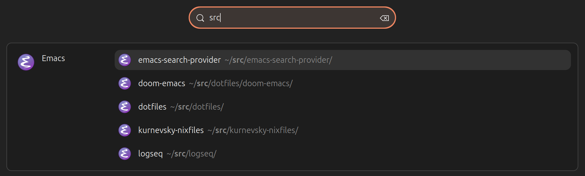
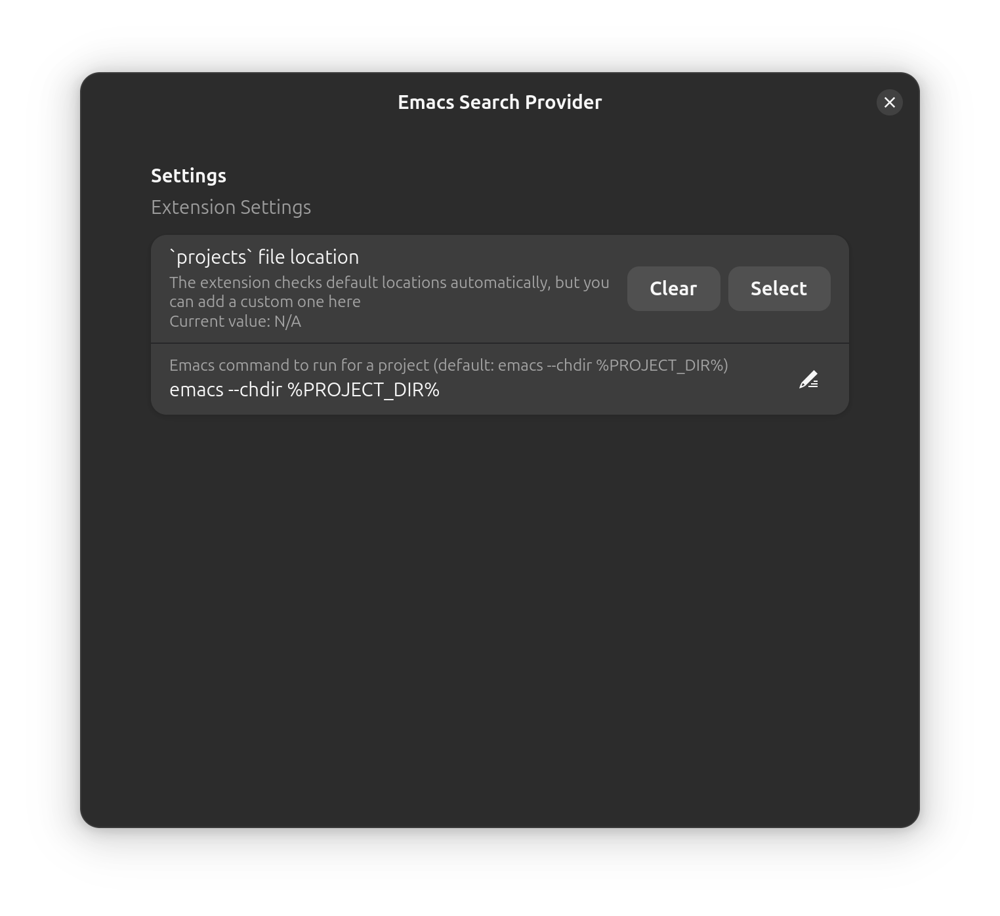

# Emacs Search Provider

 [](https://github.com/hron/emacs-search-provider/actions/workflows/eslint.yml) 

## Description



The Emacs Search Provider Extension is a GNOME Shell extension that facilitates the launching of Emacs within a specified project directory.

## Features

- Compatible with GNOME Shell versions 45 to 46, and potentially later releases.
- Compiles a list of Emacs projects managed via the built-in `project.el`
- Compiles a list of Emacs projects managed via `projectile`

## Installation

### Installing via Gnome Extensions

[](https://extensions.gnome.org/extension/8064//)

### Installing from the GitHub Repository

For the latest development version, you may need to ensure `git` and `node` are installed first. Proceed to the directory where you wish to download the source code and execute the following commands:

#### For GNOME 45+

    git clone https://github.com/hron/emacs-search-provider.git
    cd emacs-search-provider
    npm install && npm run setup

### Activating the Extension

Following installation, the extension must be enabled.

- Restart GNOME Shell (`Alt` + `F2`, `r`, `Enter`, or Log-Out/Log-In if operating on Wayland)
- The _Emacs Search Provider_ extension should now appear in the _Extensions_ application. If not visible, reopen the application to refresh the data, and you can then enable it.

## Functionality

With the introduction of `project.el` in Emacs, a standard approach to project management is possible, yet `projectile` remains popular. For this reason, the extension supports both. It performs searches and parses `projects`/`projects.eld` in standard locations, although custom paths can be configured within the settings:



To start Emacs, this extension executes `emacs --chdir %PROJECT_DIR%` by default, but you can change the command via settings. It is assumed that Emacs is configured to restore project-specific settings from the current directory. Flexibility is a hallmark of Emacs, and one configuration could involve using the built-in `desktop.el`. Here is an example configuration:

```emacs-lisp
(use-package emacs
  :init
  (desktop-save-mode +1)
  :custom
  (desktop-path (list ".")))
```

With this setup, Emacs attempts to load the `.emacs.desktop` file from the project root, restoring buffers, windows, and frame configurations akin to Visual Studio Code.

## Contribution

If you are interested in contributing, kindly fork the repository and create a feature branch. Pull requests are highly appreciated.

### Acknowledgements

This extension is significantly influenced by the outstanding work of [@MrMarble](https://github.com/MrMarble) and the contributors at [vscode-search-provider](https://github.com/MrMarble/vscode-search-provider/). We extend our gratitude to all of them.
